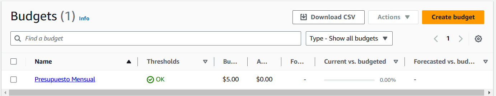
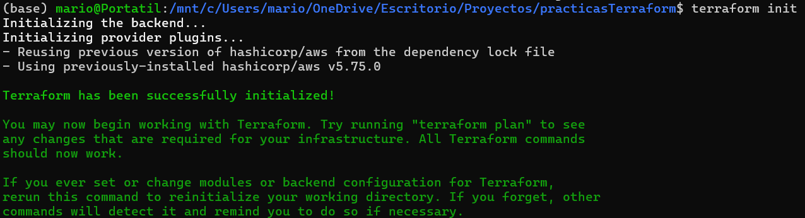
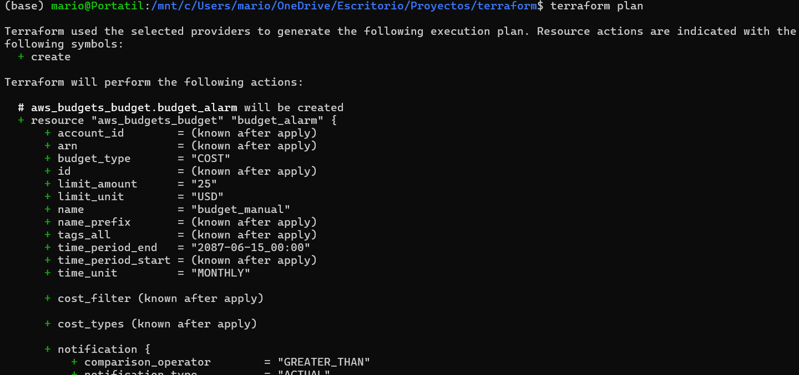
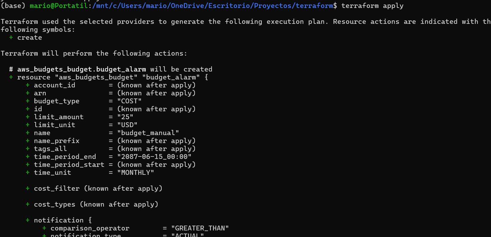
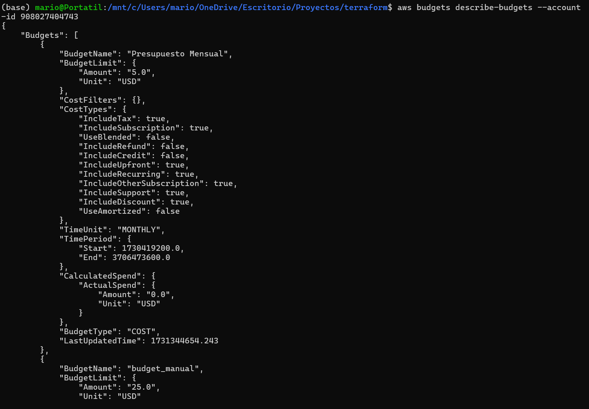

# Presupuesto en AWS

En este laboratorio se han establecido dos alarmas de presupuesto distintas, una programada en Terraform y otra impuesta manualmente en la web de AWS. En la última imagen del Readme se puede ver el output de AWS en el que se ve que las dos funcionan correctamente. En esta primera imagen vemos la alarma manual en AWS de 5€:

# Presupuesto en Terraform

En Terraform se ha configurado la segunda alarma con un presupuesto de 25€. Se puede observar cómo realizarla en el archivo "main.tf". A continuación se ven imagenes del "terraform init, plan y apply" para verificar que se ha lanzado correctamente.

# Presupuestos configurados

Podemos ver que ambos presupuestos se han configurado correctamente al realizar el comando correspondiente a la siguiente imagen:

